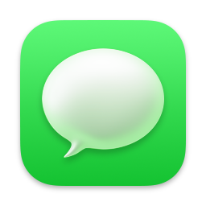
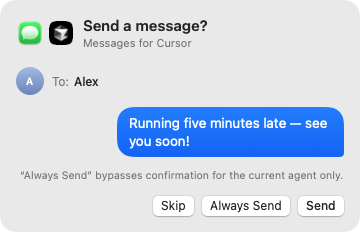

<p align="center">
  
  &nbsp;&nbsp;&nbsp;
  
</p>

<h1 align="center">Apple Messages for Cursor</h1>

<p align="center">
  Send, read, and reply to Apple Messages without leaving Cursor.
</p>

<p align="center">
  <strong>macOS only.</strong> Requires Apple Messages to be signed in on your Mac.
</p>

## Install

1. Open **Customize → Plugins** in Cursor.
2. Click **+ Add**, then choose **From GitHub**.
3. Paste this repository:

   ```text
   https://github.com/jediahkatz/cursor-apple-messages-plugin
   ```

4. Click **Add** next to **Messages**, then follow the macOS permission prompts.

## Features

- Send messages by contact name, phone number, or conversation.
- Read recent conversations and reply in context.
- Review every message in a native confirmation window.
- Keep everything local on your Mac.

<p align="center">
  
</p>

Ask Cursor:

> “Text Christina that I'm running five minutes late.”

> “What was the last message in my family chat?”

---

Looking for implementation details, permissions, tools, or local development? See [Technical notes](TECHNICAL.md).
